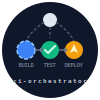

<div align="center">
  
  <h1>ci-orchestrator</h1>
  <p>Multi-platform CI/CD orchestration library for Jenkins, GitHub Actions, GitLab CI, and Bitbucket Pipelines.<br/>Build any language stack. Deploy to any CMS or framework.</p>

  [](#running-tests)
  [](LICENSE)
  [](#platform-status)
  [](https://groovy-lang.org/)
  [](https://www.jenkins.io/)
</div>

---

`ci-orchestrator` is a Jenkins shared library (with GitHub Actions, GitLab CI, and Bitbucket Pipelines support planned) that turns a single `ciorch.yml` config file into a complete CI/CD pipeline — regardless of language, framework, or branching strategy.

Instead of writing a `Jenkinsfile` from scratch for every project, you declare *what* to build and *where* to deploy, and the orchestrator figures out *which steps to run* based on the Git event (push, PR, tag, release).

## Features

- **Data-driven pipelines** — branching rules are YAML, not code. Swap strategies (`gitflow`, `github-flow`, `trunk-based`) without touching your `Jenkinsfile`.
- **Adapter pattern** — plug in any build toolchain (Node, PHP, Go, Java, Python, Rust, Docker…) or deploy target (WordPress, Drupal, Symfony, Django, FastAPI…) via a single interface.
- **Shell-injection safe** — all external values are passed through `withEnv` + single-quoted shell variables, never interpolated into Groovy strings.
- **Jenkins CPS compliant** — all classes implement `Serializable`; regex and split operations are annotated `@NonCPS`.
- **Testable** — 81 unit tests (Spock + JenkinsPipelineUnit) run without a live Jenkins instance.
- **Single config file** — `ciorch.yml` at repo root is read by every supported platform.

## Platform Status

| Platform | Status | Docs |
|---|---|---|
| Jenkins Shared Library | ✅ Phase 1 — core complete | [Getting Started](docs/jenkins/getting-started.md) |
| GitHub Actions | 🔜 Phase 4 | — |
| GitLab CI | 🔜 Phase 5 | [Preview](docs/gitlab/getting-started.md) |
| Bitbucket Pipelines | 🔜 Phase 6 | [Preview](docs/bitbucket/getting-started.md) |

## Quick Start (Jenkins)

**1. Register the library** in *Manage Jenkins → Global Pipeline Libraries*:

| Field | Value |
|---|---|
| Name | `ci-orchestrator` |
| Default version | `main` |
| Repository URL | `https://github.com/nikolareljin/ci-orchestrator.git` |

**2. Add `ciorch.yml`** to your repo root:

```yaml
ciorch:
  version: "1"
  build:
    adapter: node
    node_version: "20"
    test_command: "npm test"
    build_command: "npm run build"
  deploy:
    adapter: wordpress
    environments:
      staging:
        host: staging.example.com
        user: deploy
        path: /var/www/staging
      production:
        host: prod.example.com
        user: deploy
        path: /var/www/html
  branching:
    strategy: gitflow
  notify:
    slack:
      channel: "#deployments"
```

**3. Create a `Jenkinsfile`**:

```groovy
@Library('ci-orchestrator@main') _

ciorch(
    payload:  env.GITHUB_WEBHOOK_PAYLOAD ?: '',
    apiToken: env.GITHUB_TOKEN           ?: '',
    apiUser:  env.GITHUB_USER            ?: ''
)
```

That's it. When a webhook fires, `ci-orchestrator` parses the event, matches it against the GitFlow branching rules, and runs `lint → test → build → deploy → tag` as appropriate.

## How It Works

```
GitHub Webhook
      │
      ▼
 WebhookParser          ← parses JSON into a GitEvent
      │
      ▼
 MatrixEvaluator        ← matches event against YAML rules → task list
      │
      ▼
 PipelineOrchestrator   ← dispatches tasks sequentially
   ├── BuildAdapter     ← lint / test / build
   ├── DeployAdapter    ← pre-deploy / deploy / post-deploy
   ├── GitOperations    ← tag / commit / push
   └── Notifier         ← Slack / webhook
```

The branching strategy YAML (`resources/matrix/default-gitflow.yml`) controls which tasks run for each combination of source branch, destination branch, and event type. Rules are priority-ordered; the highest-priority match wins.

## Supported Build Adapters

| Adapter | Language | Phase |
|---|---|---|
| `docker` | Generic Docker build | ✅ 1 |
| `node` | Node.js / npm / yarn | 🔜 2 |
| `php` | PHP / Composer | 🔜 2 |
| `python` | Python / pip | 🔜 2 |
| `go` | Go modules | 🔜 2 |
| `java-maven` | Java + Maven | 🔜 2 |
| `java-gradle` | Java + Gradle | 🔜 2 |
| `dotnet` | .NET / C# | 🔜 2 |
| `rust` | Rust / Cargo | 🔜 2 |
| `cpp` | C/C++ / CMake | 🔜 2 |

## Supported Deploy Adapters

| Adapter | Target | Phase |
|---|---|---|
| `wordpress` | WordPress + WP-CLI | 🔜 3 |
| `drupal` | Drupal + Drush | 🔜 3 |
| `symfony` | Symfony + Deployer.php | 🔜 3 |
| `django` | Django + manage.py | 🔜 3 |
| `fastapi` | FastAPI + uvicorn | 🔜 3 |
| `sugarcrmm` | SugarCRM / SuiteCRM | 🔜 3 |
| `dotnetnuke` | DNN / DotNetNuke | 🔜 3 |

## Running Tests

```bash
./gradlew :tests:unit:test
```

Tests use [JenkinsPipelineUnit](https://github.com/jenkinsci/JenkinsPipelineUnit) + [Spock](https://spockframework.org/) and run without a live Jenkins instance. 81 tests covering `Version`, `MatrixEvaluator`, `WebhookParser`, and `Config`.

## Documentation

| Topic | Link |
|---|---|
| `ciorch.yml` full reference | [docs/ciorch-yml-reference.md](docs/ciorch-yml-reference.md) |
| Jenkins — Getting Started | [docs/jenkins/getting-started.md](docs/jenkins/getting-started.md) |
| Jenkins — Configuration | [docs/jenkins/configuration.md](docs/jenkins/configuration.md) |
| Git Action Matrix (rule engine) | [docs/jenkins/git-action-matrix.md](docs/jenkins/git-action-matrix.md) |
| Build Adapters | [docs/jenkins/build-adapters.md](docs/jenkins/build-adapters.md) |
| Deploy Adapters | [docs/jenkins/deploy-adapters.md](docs/jenkins/deploy-adapters.md) |
| GitLab CI (planned) | [docs/gitlab/getting-started.md](docs/gitlab/getting-started.md) |
| Bitbucket Pipelines (planned) | [docs/bitbucket/getting-started.md](docs/bitbucket/getting-started.md) |

## Project Structure

```
ci-orchestrator/
├── src/io/ciorch/
│   ├── core/           # PipelineOrchestrator, Config, SystemCall, Version, Notifier
│   ├── git/            # WebhookParser, GitEvent, MatrixLoader, MatrixEvaluator, GitOperations
│   ├── build/          # BuildAdapter interface + DockerAdapter
│   └── deploy/         # DeployAdapter interface
├── vars/               # ciorch.groovy — Jenkins global variable entry point
├── resources/matrix/   # default-gitflow.yml, github-flow.yml, trunk-based.yml
├── gitlab/             # GitLab CI templates (Phase 5)
├── bitbucket/          # Bitbucket Pipes (Phase 6)
├── tests/unit/         # Spock tests
├── assets/             # Logo and visual assets
└── docs/               # Per-platform documentation
```

## Contributing

1. Fork and clone this repository.
2. Create a feature branch: `git checkout -b feature/my-change`.
3. Add or update tests (`./gradlew :tests:unit:test`).
4. Open a pull request against `main`.

Please open an issue before starting work on large features so we can discuss the approach.

## License

[MIT](LICENSE)
